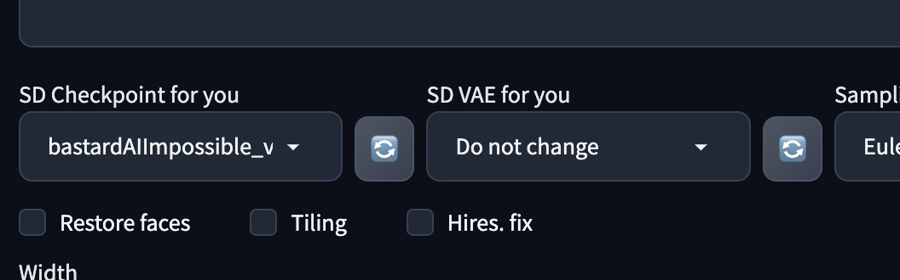

# Multi User Checkpoint
[[中文版]](./README_zh.md)  
This plugin allows multiple users to connect to a single WebUI instance and create queues with different Checkpoints and VAEs    

## Screenshot
  

## Usage
This plugin will create two drop-down menus, allowing users to select different Checkpoint and VAE respectively, and will not be affected by WebUI settings.  

## Install
1. Go to SD WebUI's `extension` tab
2. Click `Install from URL` subtab
3. Paste `https://github.com/lihaoyun6/sd-webui-Multi-User-Checkpoint` into the URL textbox
4. Click `Install` and wait for it to complete
5. Once completed, the WebUI needs to be reloaded

## Credits
- [Stable Diffusion web UI](https://github.com/AUTOMATIC1111/stable-diffusion-webui) @AUTOMATIC1111  
